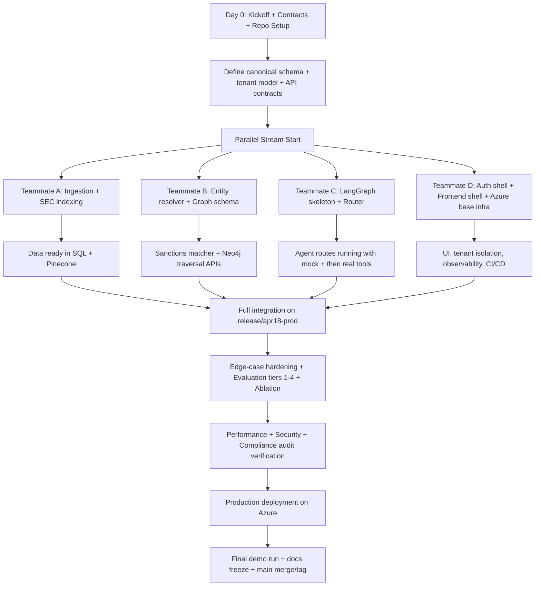

# SupplyChainNexus 4-Teammate Execution Plan (April 8 -> April 18, 2026)

**Project:** SupplyChainNexus: Multi-Tier Supplier Risk Intelligence  
**Goal:** Full-fledged production-grade enterprise product by **April 18, 2026**  
**Team Size:** 4 developers  
**Fixed Stack:** `LangGraph + Pinecone + OpenAI models/embeddings + Azure`

---

## 0) Non-Negotiables (Must Not Be Violated)

1. **Sanctions matching cannot miss aliases.**  
   `Huawei Technologies Co. Ltd.` vs `Hua-Wei Tech` vs `Huawei Device Co.` must be caught by entity resolver.  
   A false negative is compliance failure.
2. **Incomplete intelligence must be explicitly flagged.**  
   If 10-K says “a key supplier in Southeast Asia” without a name, system must mark as `INTEL_GAP`, not ignore.
3. **Recency must be weighted.**  
   Going-concern this quarter outranks stable data from last year.
4. **Data freshness must be disclosed.**  
   UN Comtrade lag (1-2 years) must be shown in answer metadata.
5. **Deep cascade traversal must scale.**  
   Tier-3 failure -> 200+ downstream products must resolve efficiently.
6. **Geospatial proximity must be computed mathematically.**  
   No keyword-only “hurricane + chemical” matching.

---

## 1) Team Split (Equal Ownership, End-to-End Coverage)

Each teammate owns one major production stream (~25% total scope), plus one cross-support stream.

## 1.1 Teammate A - Data Platform + Ingestion

**Primary ownership**
- Ingestion connectors for SEC, OFAC/BIS, Comtrade, NOAA, FDA, +2 additional sources (USGS, World Bank LPI)
- Raw/parsed/canonical data pipeline
- Book RAG/page indexing for SEC 10-K (Item 1A, Item 7, Notes)
- Metadata + freshness pipeline
- Document lifecycle backend states (`uploaded -> parsed -> indexed -> archived`)

**Cross-support**
- Hazard geospatial precompute feeds for teammate B/C

## 1.2 Teammate B - Compliance + Knowledge Graph + Entity Resolution

**Primary ownership**
- Sanctions entity resolution pipeline (deterministic + fuzzy + audit reason)
- Knowledge graph schema and graph build (multi-tier supply chain)
- Graph traversal service for downstream impact and single-point-of-failure analysis
- Compliance audit logs for sanctions screening decisions

**Cross-support**
- Real-time alerts on sanctions/hazard matches (with teammate D infra)

## 1.3 Teammate C - Agentic RAG + Router + Risk Scoring + Evaluation

**Primary ownership**
- LangGraph orchestration (state graph, checkpoints, retries)
- RAG router (minimum 4 routes, implement 5+ routes)
- Multi-hop agent pipeline across sources
- Cascading Risk Score design + implementation
- Evaluation framework (RAGAS + custom metrics + ablation study)

**Cross-support**
- Query provenance object for UI display (with teammate D)

## 1.4 Teammate D - Product, Auth, Multi-Tenancy, Deployment, Observability

**Primary ownership**
- React frontend (query interface + admin dashboard + graph/map views)
- Authentication + RBAC + multi-tenant data isolation
- Azure deployment, CI/CD, release pipeline
- Structured logging + observability (LangSmith + Azure Monitor)
- Slack/webhook notifications

**Cross-support**
- Demo flow, docs, and final release cut coordination

---

## 2) Branching Strategy and Git Instructions (Mandatory)

## 2.1 Branch Model

- Protected: `main`
- Integration: `release/apr18-prod`
- Teammate long-lived feature branches:
  - `feat/dev-a-data-ingestion`
  - `feat/dev-b-compliance-graph`
  - `feat/dev-c-agentic-router-eval`
  - `feat/dev-d-product-platform`

## 2.2 First-Time Commands (Each Teammate)

```bash
git checkout main
git pull --ff-only origin main
git checkout -b feat/dev-<a|b|c|d>-<stream-name>
git push -u origin feat/dev-<a|b|c|d>-<stream-name>
```

## 2.3 Daily Sync Commands

```bash
git fetch origin
git checkout feat/dev-<...>
git pull --rebase origin feat/dev-<...>
git rebase origin/release/apr18-prod
```

## 2.4 PR Rules

- No direct commits to `main`.
- All PRs target `release/apr18-prod` until final cut.
- Each PR must include:
  - scope
  - tests added
  - logs/metrics touched
  - edge cases covered
  - rollback note
- Minimum 1 reviewer from another stream.

## 2.5 Merge Gate

PR merge allowed only if:
- unit/integration tests pass
- lint/type checks pass
- minimum eval smoke suite passes
- no secrets in diff

---

## 3) Build Order Flow (What We Do First -> Last)



---

## 4) Work Breakdown Structure (WBS) by Teammate

## 4.1 Teammate A - Detailed Task List

1. Implement source connectors:
   - SEC EDGAR 10-K
   - OFAC SDN
   - BIS Entity List
   - UN Comtrade
   - NOAA Storm Events
   - FDA warning letters/import alerts
   - USGS Mineral Commodity Summaries
   - World Bank LPI
2. Build canonical normalization layer:
   - country codes, dates, company fields, IDs
3. SEC book/page indexing:
   - section split (Item 1A, Item 7, Notes)
   - supplier mention extraction
   - temporal tagging (filing period)
4. Pinecone indexing:
   - chunk + metadata filters + tenant namespace
5. Data freshness framework:
   - `source_as_of`, `ingested_at`, `freshness_warning`
6. Document lifecycle backend states + events
7. Tests:
   - parser accuracy checks
   - stale data disclosure checks

**DoD**
- all source ingestions are idempotent
- SEC target sections indexed and queryable
- freshness metadata appears in retrieval output

## 4.2 Teammate B - Detailed Task List

1. Build sanctions entity matcher:
   - normalization
   - alias expansion
   - deterministic exact checks
   - fuzzy scoring pipeline
   - thresholding + human review band
2. Build compliance explanation log:
   - why matched/not matched
   - score + alias + threshold
3. Create knowledge graph schema:
   - Company -> Tier1 -> Tier2 -> Component -> RawMaterial -> SourceCountry -> HazardZone -> SanctionsStatus
4. Implement graph ingestion/upsert
5. Build traversal APIs:
   - downstream impacted products
   - single-point-of-failure detection
6. Geospatial join methods:
   - facility to hazard region proximity calculations
7. Tests:
   - Huawei alias variants
   - deep traversal over 200+ product propagation

**DoD**
- alias test suite has no missed known variants
- traversal APIs return complete impacted set
- sanctions audit records stored per query

## 4.3 Teammate C - Detailed Task List

1. LangGraph orchestration:
   - state model
   - node graph
   - persistence/checkpoints
2. Router implementation:
   - financial
   - sanctions/compliance
   - commodity/trade
   - hazard/geospatial
   - quality/regulatory
   - composite multi-source route
3. Agentic pipeline:
   - tool-calling per supplier
   - cross-source evidence fusion
4. Recency-weighted reasoning logic
5. Cascading Risk Score formula and implementation
6. Evaluation framework:
   - Tier 1-4 30 query harness
   - RAGAS integration
   - custom CRS metric
   - ablation experiments
7. Tests:
   - “stable last year, going concern this quarter” should prioritize recent data

**DoD**
- all routes work with confidence and fallback
- Tier 1+2 pass baseline acceptance
- ablation report generated

## 4.4 Teammate D - Detailed Task List

1. Frontend:
   - enterprise query UI
   - source citations panel
   - graph visualization
   - map hazard overlay
   - admin dashboard
2. Auth + RBAC:
   - roles: admin/analyst/auditor
3. Multi-tenancy:
   - tenant isolation across API/SQL/Pinecone/graph
4. Deployment:
   - Azure Container Apps backend
   - Azure Static Web Apps frontend
   - Key Vault + managed identity
   - CI/CD (build/test/eval/deploy)
5. Observability:
   - LangSmith tracing
   - structured JSON logs with correlation IDs
   - Azure Monitor dashboards
6. Notifications:
   - Slack/webhooks for ingest/eval/risk/sanctions updates
7. UX polish:
   - enterprise-grade visual quality, responsive layout, loading/error states

**DoD**
- live URL up with auth and tenant isolation
- trace logs show full request lineage
- admin dashboard shows pipeline and metrics

---

## 5) Required Advanced Concepts Coverage Matrix

| Advanced Concept | Implementation Owner | Supporting Owner(s) | Acceptance Check |
|---|---|---|---|
| Knowledge Graph (multi-tier) | B | A, C | Traversal answers downstream impact correctly |
| RAG Router (>=4 routes) | C | A, B | Route logs show correct path and source usage |
| Book RAG / Page Indexing | A | C | Item 1A/7/Notes retrieval with temporal tags |
| Agentic RAG multi-step | C | B | Query plan executes all domain checks |
| Multimodal RAG (geo + tables + lists) | A/B | C, D | Map+table+entity results in one response |
| Entity Resolution (sanctions exact+fuzzy) | B | C | Alias precision/recall threshold met |
| Evaluation + custom CRS | C | A, B, D | Tier suite + CRS report generated |

---

## 6) Enterprise Requirements Coverage Matrix

| Requirement | Owner | Supporting | Verification |
|---|---|---|---|
| LLM observability | D | C | LangSmith traces for full workflow |
| Structured logging + correlation IDs | D | all | log schema enforced in middleware |
| Performance metrics | D | C | dashboard p95 route, graph, match latencies |
| Slack/webhook notifications | D | B | alert events emitted and received |
| Real-time risk alerts | B | D | monitored entity triggers instant event |
| Compliance audit log | B | D | sanctions query stores full audit record |
| Query provenance | C | D | response includes route/sources/computation |
| Entity match decision reason | B | C | decision object includes score and threshold |

---

## 7) Edge Cases -> Owner -> Test

| Edge Case | Owner | Implementation | Test ID |
|---|---|---|---|
| Huawei alias variants | B | deterministic + fuzzy matcher + alias graph | `EC_SANCTION_001` |
| Unnamed supplier in 10-K | A/C | `INTEL_GAP` flag + confidence drop + user warning | `EC_SEC_002` |
| Recent going-concern warning | C | recency weighting in scoring/reranking | `EC_TEMPORAL_003` |
| Comtrade lag disclosure | A/D | freshness metadata and UI badge | `EC_FRESHNESS_004` |
| Tier-3 failure cascades to 200+ products | B/C | optimized graph traversal + pagination | `EC_GRAPH_005` |
| Hurricane proximity for 15 plants | B/A | geo distance calculations + hazard radius | `EC_GEO_006` |

---

## 8) 30 Evaluation Queries Ownership

## 8.1 Query Pack Split

- **Teammate A:** Tier 1 Q2,Q5,Q7 + Tier 2 Q10,Q13,Q14,Q15 + Tier 3 Q21,Q22  
- **Teammate B:** Tier 1 Q1 + Tier 2 Q11,Q12 + Tier 3 Q16,Q18,Q19,Q23 + Tier 4 Q27  
- **Teammate C:** Tier 1 Q4,Q6 + Tier 2 Q8,Q9 + Tier 3 Q20 + Tier 4 Q24,Q25,Q26,Q28,Q29,Q30  
- **Teammate D:** QA orchestration for all query outputs in UI + evaluation dashboard + evidence rendering

**Rule:** C owns evaluation harness; all teammates contribute expected-answer fixtures for their query set.

---

## 9) Day-by-Day Plan (Absolute Dates)

## 9.1 April 8, 2026 (Today) - Foundation Lock

All:
- finalize contracts, schema, API specs, branch creation, CI skeleton

A:
- ingestion scaffolding + SEC parser skeleton

B:
- sanctions matcher skeleton + graph schema draft

C:
- LangGraph state + node placeholders + router labels

D:
- frontend shell + auth shell + infra bootstrap

## 9.2 April 9

A:
- SEC + OFAC/BIS ingestion live

B:
- alias normalization + exact matcher

C:
- router v1 + financial/sanctions route stubs

D:
- RBAC middleware + tenant context plumbing

## 9.3 April 10

A:
- Comtrade + NOAA ingestion + freshness metadata

B:
- fuzzy matching + decision thresholds + audit schema

C:
- trade/hazard routes + evidence fusion draft

D:
- structured logging middleware + correlation IDs + App Insights

## 9.4 April 11

A:
- FDA ingestion + SEC section indexing complete

B:
- graph ingestion pipeline + traversal APIs v1

C:
- composite route + recency weighting implementation

D:
- query UI + citations + doc lifecycle view

## 9.5 April 12

A:
- USGS + LPI ingestion

B:
- geospatial hazard proximity engine

C:
- risk score v1 + full LangGraph checkpointing

D:
- notifications (Slack/webhooks) wiring

## 9.6 April 13

Integration milestone #1 (`release/apr18-prod`):
- ingestion + graph + router integrated
- first end-to-end Tier 1 run

## 9.7 April 14

A:
- data quality + backfill scripts

B:
- graph performance tuning for deep cascades

C:
- Tier 2 + Tier 3 evaluation harness

D:
- graph/map visualization in UI

## 9.8 April 15

A/B:
- edge case hardening: unnamed suppliers + alias misses + geospatial checks

C:
- Tier 4 pipeline scenarios + ablation runs

D:
- admin dashboard metrics + eval dashboard

## 9.9 April 16

Integration milestone #2:
- full 30-query pass attempt
- compliance and audit trail validation
- multi-tenant penetration test basics

## 9.10 April 17

- performance tuning
- bug burn-down
- production staging rehearsal
- documentation and demo recording prep

## 9.11 April 18 (Release Day)

- final production deploy
- smoke tests
- demo run
- tag release
- merge `release/apr18-prod` -> `main`

---

## 10) Production-Ready Quality Gates

## 10.1 Functional Gate

- all 30 queries execute
- no blocking route failures
- citations and provenance visible

## 10.2 Compliance Gate

- sanctions alias tests pass
- audit log completeness verified
- no silent incomplete-intelligence behavior

## 10.3 Reliability Gate

- retries and dead-letter handling verified
- ingestion error alerts working

## 10.4 Performance Gate

- graph traversal p95 within target
- query p95 within agreed SLA

## 10.5 Security Gate

- RBAC checks pass
- tenant isolation tests pass
- secrets only in Key Vault

## 10.6 UX Gate (Enterprise Aesthetic)

- responsive desktop/mobile
- coherent design system (colors, typography, spacing)
- clear loading/error/empty states
- graph and map views usable for analyst workflows

---

## 11) Definition of Done (Project-Wide)

Project is done only when all are true:

1. Deployed live URL works end-to-end.
2. Auth + RBAC + multi-tenant isolation verified.
3. Document lifecycle supports upload -> parse -> index -> archive.
4. Graph view + map view available in React app.
5. Router has 5+ working retrieval strategies.
6. Agentic multi-hop pipeline works for Tier-4 queries.
7. Sanctions entity resolver handles alias variants with audit reasoning.
8. Evaluation framework with RAGAS + custom CRS runs and reports.
9. Ablation report produced.
10. LangSmith traces + JSON logs + correlation IDs active.
11. Slack/webhook alerts active for required events.
12. GitHub documentation complete.

---

## 12) Daily Operating Cadence (Fast Completion Mode)

- 09:30 - 09:45: Standup (blockers + today’s goal)
- 14:00 - 14:15: Integration check
- 20:00 - 20:15: End-of-day merge window planning

**Rule:** no teammate ends day without:
- pushing branch,
- opening/updating PR,
- posting blocker note,
- updating checklist status.

---

## 13) PR Checklist Template (Copy into every PR)

```markdown
## Scope
- [ ] Feature implemented
- [ ] Linked task IDs

## Quality
- [ ] Unit tests added/updated
- [ ] Integration tests added/updated
- [ ] Edge case tests added (IDs: ...)

## Compliance/Observability
- [ ] Structured logs added
- [ ] Correlation ID propagated
- [ ] Audit trail updated (if sanctions-related)

## Docs
- [ ] README/docs updated

## Risk
- [ ] Rollback plan noted
- [ ] Known limitations listed
```

---

## 14) Final Release Steps

1. Freeze new feature merges at noon on April 18.
2. Run full eval suite + smoke tests.
3. Validate alerts + logs + audit exports.
4. Promote production artifacts.
5. Tag release:
   - `v1.0.0-apr18`
6. Merge release branch to main.

---

## 15) Quick Start Commands for Each Teammate

```bash
# 1) create branch
git checkout main
git pull --ff-only origin main
git checkout -b feat/dev-<a|b|c|d>-<stream-name>
git push -u origin feat/dev-<a|b|c|d>-<stream-name>

# 2) keep updated daily
git fetch origin
git rebase origin/release/apr18-prod

# 3) push and open PR to release branch
git push
```

---

## 16) Ownership Summary (One-Line)

- **A:** Data ingestion + SEC indexing + freshness + lifecycle backend  
- **B:** Sanctions matcher + graph + traversal + compliance audit  
- **C:** LangGraph router/agents + risk scoring + evaluation/ablation  
- **D:** Frontend + auth/RBAC + multi-tenant + Azure deploy + observability/alerts

This split is equal, complete, and covers ingestion -> intelligence -> UI -> deployment for a production-grade launch by **April 18, 2026**.

